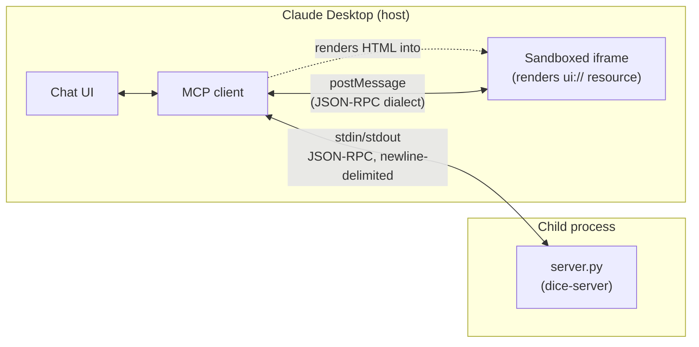

# How Claude Desktop talks to `server.py`

This explains the actual mechanics behind the dice-roller demo: how Claude
Desktop finds and connects to `server.py`, exactly what JSON comes back over
the wire, and how that turns into a live, clickable card inside the chat.

## 1. Connection: Claude Desktop spawns the server as a subprocess

Claude Desktop doesn't "connect" over a network — it **launches `server.py`
as a child process** and talks to it over its stdin/stdout, using the
command/args from `claude_desktop_config.json`:

```json
"mcpServers": {
  "dice-server": {
    "command": "/usr/bin/python3",
    "args": ["/Users/.../dice-server/server.py"]
  }
}
```

Every message in both directions is one line of JSON-RPC 2.0 on that pipe.
`server.py` enforces a strict rule because of this: **stdout is only ever
JSON-RPC** — any logging goes to stderr instead, or it would corrupt the
stream mid-message.



Note the two *separate* channels: Claude Desktop `<-> server.py` over stdio,
and Claude Desktop `<-> iframe` over `postMessage`. The iframe never talks to
`server.py` directly — the host always sits in the middle and mediates
everything (that's the security boundary from episode 02's notes).

## 2. What the server responds with, at each step

| Client sends (method) | Server responds with |
|---|---|
| `initialize` | `protocolVersion`, `capabilities: {tools: {}, resources: {}}`, `serverInfo` |
| `tools/list` | One tool, `roll_dice`, whose definition includes `_meta.ui.resourceUri: "ui://dice-server/roller"` — this is the line that tells the host "this tool has a UI" |
| `tools/call` (`roll_dice`) | `content` (plain text fallback: `"Rolled a 19 on a d20."`) **and** `structuredContent: {sides, value}` — the structured data is what the UI actually reads |
| `resources/list` | The one resource: `uri: "ui://dice-server/roller"`, `mimeType: "text/html;profile=mcp-app"` |
| `resources/read` | The full HTML/JS page as `contents[0].text`, plus `_meta.ui.csp` / `_meta.ui.permissions` (both empty here — the page is fully self-contained, no external domains or device permissions needed) |

The `mimeType: "text/html;profile=mcp-app"` on the resource is the signal
that tells Claude Desktop "don't just show this as a text/code block — render
it as an MCP App."

## 3. How it renders: from tool call to clickable card

```mermaid
sequenceDiagram
    participant User
    participant Host as Claude Desktop
    participant Server as server.py
    participant App as Iframe (UI_HTML)

    User->>Host: "roll a d20"
    Host->>Server: tools/call roll_dice {sides: 20}
    Server-->>Host: content + structuredContent {sides:20, value:19}
    Note over Host: tool definition said this tool has a ui:// resource
    Host->>Server: resources/read ui://dice-server/roller
    Server-->>Host: HTML/JS page (text/html;profile=mcp-app)
    Host->>App: render HTML in sandboxed iframe
    App->>Host: ui/initialize (postMessage)
    Host-->>App: hostInfo, hostContext (theme, size...)
    App->>Host: ui/notifications/initialized
    Host-->>App: ui/notifications/tool-result {structuredContent}
    Note over App: renders "19 / rolled a 19 (d20)"

    User->>App: clicks "Roll Again"
    App->>Host: tools/call roll_dice {sides:20}  (request, own id)
    Host->>Server: tools/call roll_dice {sides:20}
    Server-->>Host: content + structuredContent {value: new roll}
    Host-->>App: response matched by id
    Note over App: re-renders with new value, no model round trip
```

Two things worth noticing in that diagram:

- **The first roll is model-initiated.** The model decided to call
  `roll_dice`; the host then discovers (from the tool's `_meta.ui`) that it
  should also fetch and render the UI resource, and pushes the result into
  it via a *notification* (`ui/notifications/tool-result`) — the app didn't
  ask for it, the host just delivers it.
- **"Roll Again" is app-initiated.** The iframe itself sends a `tools/call`
  *request* (with its own numeric `id`) straight to the host, which forwards
  it to `server.py` and routes the *response* back to the iframe by matching
  that `id`. The model isn't involved in this leg at all — that's what makes
  the card interactive instead of a one-shot snapshot.

## 4. The sandbox boundary

The iframe is sandboxed: it can't read Claude Desktop's DOM, cookies, or
storage, and can't navigate the parent window. Its *only* way to affect
anything outside itself is by sending JSON-RPC messages over `postMessage`,
which the host inspects and mediates — same trust model as a normal tool
call. `server.py` never receives a raw message from the iframe; it only ever
receives `tools/call` requests forwarded (and implicitly authorized) by
Claude Desktop.
